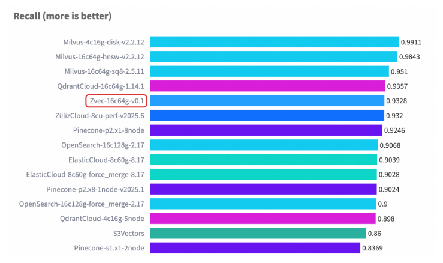
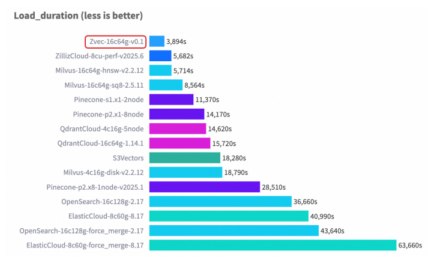

import { Step, Steps } from 'fumadocs-ui/components/steps';

**Zvec** is engineered for speed, scale, and efficiency — and has been battle-tested across demanding production workloads within Alibaba Group.

Below, we present benchmark results that demonstrate how our system performs under various workloads and configurations.

All tests were conducted in controlled environments using standardized datasets and widely accepted methodologies to ensure fairness, transparency, and reproducibility.

## Performance Evaluation

We evaluate Zvec using [**VectorDBBench**](https://github.com/zilliztech/VectorDBBench), an open-source benchmarking framework widely adopted in the vector database community.

Our evaluation focus on two standard datasets:

- **Cohere 1M**: 1 million 768-dimensional vectors
- **Cohere 10M**: 10 million 768-dimensional vectors

For each dataset, we measure the following key performance indicators:

- **Queries Per Second (QPS)**: Throughput under sustained load.
- **Recall**: Accuracy of nearest neighbor retrieval, reflecting search quality.
- **Index Build Time (load duration)**: Time required to ingest and index the full dataset, indicating ingestion efficiency.

### Cohere 10M Benchmark Results






### Cohere 1M Benchmark Results


## Reproducing the Benchmarks

Follow these steps to reproduce our benchmark results in your own environment.

<Steps>

<Step>

### Prepare environment

</Step>

1. **Launch an ECS Instance**
    <Callout className="text-base" type="info">
      We recommend using **Ubuntu 24.04** as the operating system. Other OS choices may require adjustments to the commands in this guide.
    </Callout>

    - Create a **g9i.4xlarge** instance (16 vCPU, 64 GiB RAM) following [this guide](https://help.aliyun.com/zh/ecs/user-guide/quickly-purchase-a-windows-instance-and-build-an-iis-service?spm=a2c4g.11186623.0.0.5ded5144WlIwMl)

1. **Install System Dependencies**
    - Install git if not already installed

      ```bash
      apt-get update
      apt install git
      ```

    - Install Python3.11 or higher

      ```bash
      apt-get update
      apt install python3-full python3-venv python3-dev

      cd /opt
      python3 -m venv venv
      source venv/bin/activate
      ```

1. **Install [VectorDBBench](https://github.com/zilliztech/VectorDBBench)**

    <Callout className="text-base" type="info">
      You may need to use our fork until our <a href="https://github.com/zilliztech/VectorDBBench/pull/692">PR</a> is merged by upstream.
    </Callout>

      ```bash
      # Clone VectorDBBench
      git clone https://github.com/egolearner/VectorDBBench.git
      cd VectorDBBench

      # Install deps
      pip install -U pip
      pip install -e .

      # If you experience slow downloads or connection issues, you can try Aliyun PyPI mirror
      # pip install -U pip -i https://mirrors.aliyun.com/pypi/simple
      # pip install -e . -i https://mirrors.aliyun.com/pypi/simple
      ```

1. **Install zvec**

    ```bash
    pip install zvec==v0.1.1
    ```

<Step>

### Run Benchmarks

</Step>

#### Cohere 10M

1. **Build Index**

    ```bash
    vectordbbench zvec --path Performance768D10M --db-label 16c64g-v0.1 --case-type Performance768D10M --num-concurrency 12,14,16,18,20 --quantize-type int8 --m 50 --ef-search 118 --is-using-refiner
    ```

1. **Run Benchmark**

    ```bash
    vectordbbench zvec --path Performance768D10M --db-label 16c64g-v0.1 --case-type Performance768D10M --num-concurrency 12,14,16,18,20 --quantize-type int8 --m 50 --ef-search 118 --is-using-refiner --skip-drop-old --skip-load
    ```

#### Cohere 1M

1. **Build Index**

    ```bash
    vectordbbench zvec --path Performance768D1M --db-label 16c64g-v0.1 --case-type Performance768D1M --num-concurrency 12,14,16,18,20 --quantize-type int8 --m 15 --ef-search 180
    ```

1. **Run Benchmark**

    ```bash
    vectordbbench zvec --path Performance768D1M --db-label 16c64g-v0.1 --case-type Performance768D1M --num-concurrency 12,14,16,18,20 --quantize-type int8 --m 15 --ef-search 180 --skip-drop-old --skip-load
    ```

</Steps>
