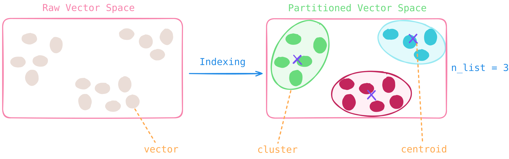
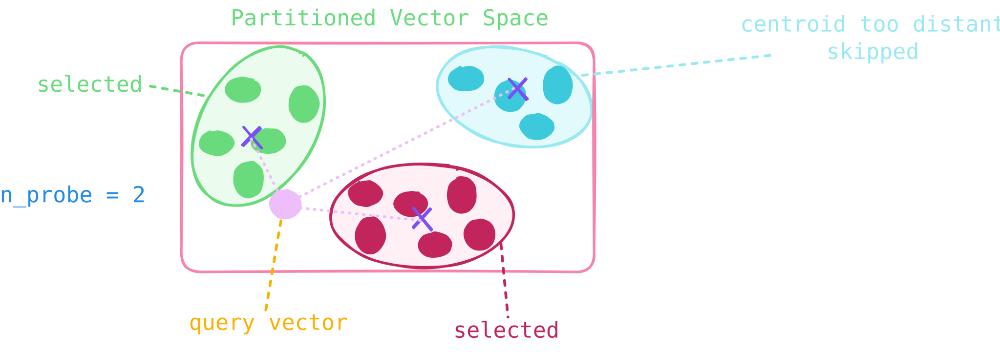

import { CodeExampleLinkButton, PythonLinkButton, NodeJSLinkButton } from 'components/LinkButton.tsx';

A partition-based, scalable, memory-efficient indexing method best suited for large datasets — especially those with natural cluster structure — at the expense of slower indexing and more involved tuning

## How It Works

IVF operates by **partitioning the entire vector space into clusters**. The number of clusters is controlled by the parameter [`n_list`](#key-parameters) (short for "number of lists").

### Indexing Phase ⚙️

1. **Clustering**: The algorithm first applies a clustering algorithm, creating `n_list` clusters. Each cluster is represented by its centroid — a central point that best represents all vectors assigned to that cluster.

1. **Assignment**: Each vector in the dataset is assigned to the **cluster whose centroid is closest** to it. The vector is then stored in an inverted list (also called a "bucket") associated with that centroid. The index essentially becomes a mapping from centroids to their associated vectors.

### Query Phase 🔍

1. **Centroid Selection**: When a query vector arrives, the system first computes distances between the query and all `n_list` centroids to identify the `n_probe` nearest centroids (`n_probe` is a parameter that controls how many centroids to consider).

1. **Local Search**: Instead of scanning the entire dataset of `N` vectors, the search is **restricted to only the vectors stored in the `n_probe` selected buckets**. A brute-force (or refined) search is then performed within those buckets to find the final nearest neighbors.

## When to Use an IVF Index

- ✅ Your vector dataset exhibits natural clustering or locality structure
- ✅ You’re working with very large datasets and memory efficiency is critical
- ✅ You need to tune parameters to achieve optimal performance

<Callout className="text-base" type="idea">
  **Best Practice**:  
  - IVF works best on datasets with inherent clustering structure.  
  - For even greater memory efficiency and scalability, combine it with Product Quantization (PQ).  
  - The performance of IVF is highly sensitive to parameters like `n_list`. As such, IVF is best suited for practitioners who can systematically experiment with, validate, and optimize these settings for their specific data distribution and latency-recall requirements.
</Callout>

## Advantages

1. ✨ **Compatibility** — Often used as a base layer in composite indexes (e.g., IVF-PQ) for further optimization
1. ✨ **Scalability** — Query time scales approximately as **O(N / `n_list` × `n_probe`)**, making it highly efficient for large `N` when `n_list` is large and `n_probe` is small
1. ✨ **Memory Efficiency** — Stores vectors in compact inverted lists with minimal overhead from centroids and list pointers, typically uses significantly less memory than graph-based methods like [HNSW](../hnsw-index/)

## Trade-offs

1. ⚠️ **Indexing Overhead** — Building the index requires clustering, which can be computationally intensive and slower to build than indexes like [HNSW](../hnsw-index/)
1. ⚠️ **Parameter Sensitivity** — Accuracy and latency are highly dependent on the choice of `n_list` and `n_probe`

## Key Parameters

### Index-Time Parameters

  <CodeExampleLinkButton url="../../../collections/create/#ivf-example" label="Code Example" />
  <PythonLinkButton url="/api-reference/python/params/#zvec.model.param.IVFIndexParam" label="Python API Reference" />
  <NodeJSLinkButton url="/api-reference/nodejs/interfaces/ZVecIVFIndexParams" label="Node.js API Reference" />

| Parameter | Description | Tuning Guidance |
| --------- | ----------- | --------------- |
| `metric_type` | **Similarity metric** used to compare vectors | Choose based on how your embeddings were trained |
| `n_list` | **Number of clusters** (inverted lists) — the vector space is partitioned into this many clusters during indexing | • Start with `n_list` ≈ $\sqrt{N}$, where `N` is the number of vectors   • Larger `n_list` → ✨ finer partitioning, smaller buckets, faster search — but ⚠️ higher indexing cost and more centroids to manage   • Smaller `n_list` → ✨ faster index construction — but ⚠️ larger buckets and slower search |
| `n_iters` | **Centroid refinement iterations** — number of passes to optimize cluster centroids during indexing | • Higher `n_iters` →   ✨ better clustering quality   ⚠️ longer index build time |
| `quantize_type` | **Vector quantization method** to apply   Defaults to no quantization | See [Quantization](../quantization/) for more details |

### Query-Time Parameters

  <CodeExampleLinkButton url="../../../data-operations/query/single-vector/#ivf-example" label="Code Example" />
  <PythonLinkButton url="/api-reference/python/params/#zvec.model.param.IVFQueryParam" label="Python API Reference" />
  <NodeJSLinkButton url="/api-reference/nodejs/interfaces/ZVecIVFQueryParams" label="Node.js API Reference" />

| Parameter | Description | Tuning Guidance |
| --------- | ----------- | --------------- |
| `n_probe` | **Number of clusters to search at query time** — the system retrieves candidates only from these nearest clusters. | • Higher `n_probe` →   ✨ higher recall   ⚠️ slower queries |
| `radius` | **Distance (similarity) threshold** for range-based filtering — only documents satisfying the threshold are returned | Example: With inner product metric `MetricType.IP`, set `radius=0.6` to  keep only results with score > 0.6   ✅ Use when: You want to filter out low-quality matches   🚫 Skip when: You want all top-k results, regardless of quality |
| `is_linear` | Forces a **brute-force linear search** instead of using the index | 🐌 Very slow for large datasets!   ✅ Only use for: Debugging, tiny collections, or verifying index accuracy |
