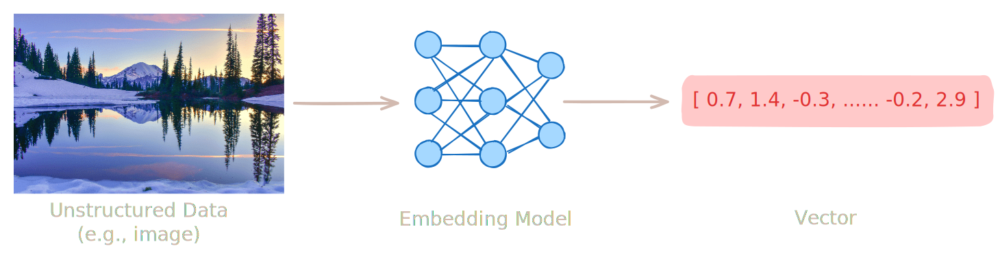
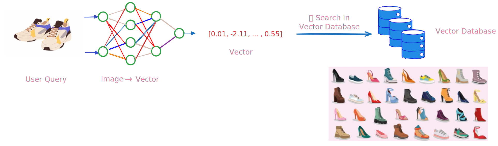

<a id="vector-embedding-diagram"></a>


## What is a Vector?

In the context of AI and vector databases, ***a vector is a list of numbers generated by embedding models to capture the semantic essence of unstructured data*** —  such as text, images, or audio.

These models transform raw input into a high-dimensional space where ***semantically similar items produce similar vectors***, enabling AI systems to compare meaning rather than relying on exact word matches.

---

## How Do You Use Vectors with a Database?

1. 🗂️ **Store**: Generate embeddings from your data — documents, product images, or user profiles — and save them in the vector database.
1. 🔍 **Search**: When a new query arrives (a question, photo, etc.), generate a **query vector** using the same embedding model, then ask the database to find the most similar stored vectors.

Using [efficient indexes](../vector-index/), the database quickly returns relevant results — even at large scale. This is the foundation of semantic search: **finding what ***means*** the same, not just what ***says*** the same**.

---

## How Vectors Power Real-World Applications?

**Image search** is a great example:

- Each image is converted into a vector that captures its visual features — such as shape, color, and object type.
- Images that are **visually or semantically similar end up with nearby vectors**.

By comparing these vectors, systems can:

- ✅ **Recognize the same person across different photos**: Even with changes in lighting, pose, or expression, images of one individual generate similar vectors, allowing the system to match identities reliably.
- ✅ **Find look-alike products in e-commerce**: When a user snaps a photo of a dress, lamp, or sofa, the system compares its vector to product vectors and retrieves items with similar appearance or style.

All of this happens through fast vector similarity comparisons, powered by the vector database.



---

## What is an Embedding Model?

An embedding model is an AI model that converts raw data into vector embeddings — illustrated in the [diagram](#vector-embedding-diagram) at the top.

These models learn patterns from vast amounts of training data so that objects with similar meanings produce vectors that are close together in vector space — typically measured using distance metrics such as **cosine similarity**, **dot product**, or **Euclidean distance**.

<Callout className="text-base" type="info">
  **The choice of distance metric matters.** If an embedding model was trained for a specific metric (e.g., cosine similarity), the vector database should use the same metric during search to preserve semantic relationships and achieve optimal accuracy.
</Callout>

To explore and compare state-of-the-art embedding models, you can check out the [Embedding Leaderboard on Hugging Face](https://huggingface.co/spaces/mteb/leaderboard), which evaluates hundreds of models across diverse tasks and languages.

---

## Types of Vectors

Vector representations are primarily categorized into two types: ***dense*** and ***sparse***, each capturing data in its own way.

### Dense Vectors

Dense vectors are fixed-length, real-valued embeddings where (nearly) every dimension carries semantic information. These vectors are often generated by deep learning models that transform raw inputs (e.g., text, images, audio) into a structured vector space reflecting their semantic similarities.

```python
# Example: 384-dimensional dense vector from a neural network model
dense_vector = [ 0.012, -0.034, 0.005, 0.041, -0.022, ..., 0.018 ]  # Length = 384
```

- **✅ Semantic-Rich**: understands context and meaning (e.g., "king – man + woman ≈ queen")
- **⚠️ Opaque**: hard to interpret which features drive similarity

### Sparse Vectors

Sparse vectors are high-dimensional, often vocabulary-sized representations in which only a small subset of dimensions are non-zero. Each active dimension corresponds to a specific term (e.g., a word or n-gram), weighted by relevance scores such as **BM25**.

In this model, every document is converted into a vector — called a document vector — that records which terms appear in it and how important they are. Similarly, a search query is also turned into a sparse vector using the same weighting scheme.

Rather than relying on exact keyword matches, similarity between a query and a document is computed using the dot product of their vectors. This measures how well their weighted terms align: documents that contain the same important terms as the query receive higher scores — rewarding both **term overlap** and **term importance**.

```python
# Example: Sparse vector over a vocabulary of 50,000 terms, stored as {term: weight}
sparse_vector = {
    "puppy": 2.31,
    "dog": 1.85,
    "pet": 1.12,
    "animal": 0.76
}
# The remaining ~49,996 dimensions are implicitly zero.
```

For computational efficiency, sparse vectors use integer indices to map terms to their positions within a vocabulary dictionary rather than storing the term strings directly.

```python
# Vocabulary mapping, containing around 50,000 unique terms, indexed by integer IDs
vocab = {
    "animal": 124,
    "dog": 309,
    "pet": 1822,
    "puppy": 4017,
    "cat": 5001,
    "kitten": 7890,
    # ... (many other terms fill the rest of the dictionary)
    # Total size ≈ 50,000
}

# Sparse vector stored as {index: weight}
sparse_vector = {
    4017: 2.31,   # "puppy"
    309: 1.85,    # "dog"
    1822: 1.12,   # "pet"
    124: 0.76     # "animal"
}
# The remaining ~49,996 dimensions are implicitly zero.
```

- **✅ Interpretable**: non-zero dimensions map directly to known terms (e.g., `4017` → "puppy")
- **⚠️ Lacks Semantic Understanding**: treats "car" and "automobile" as unrelated unless explicitly linked
